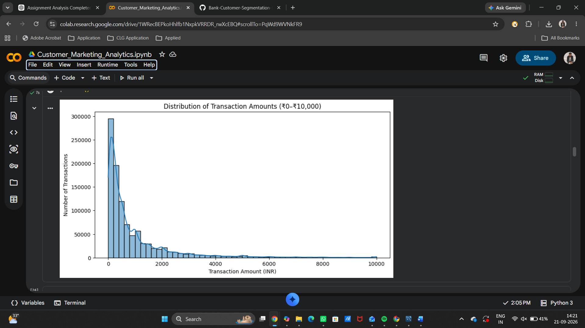
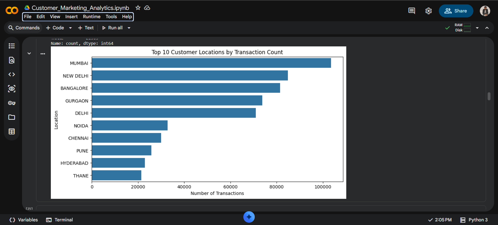
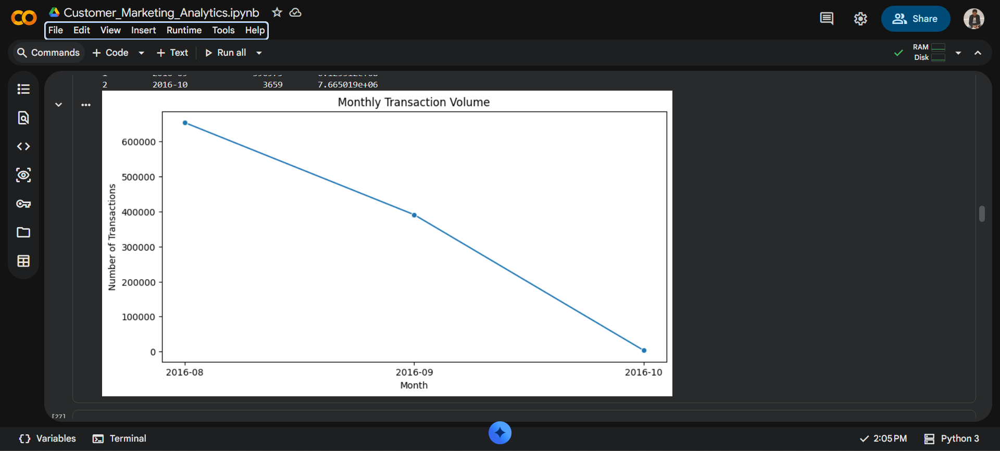
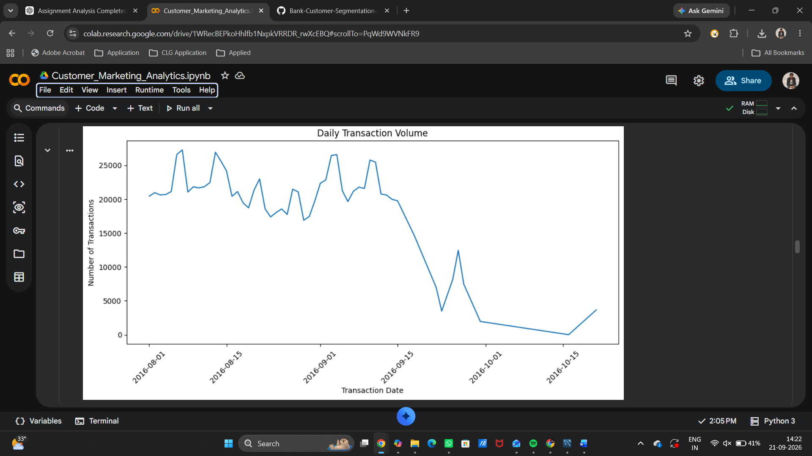

# Indian Banking Customer Segmentation & Marketing Analytics

## 📌 Project Overview

This project analyzes customer transaction data to identify different customer behaviour patterns and derive actionable marketing insights.

The analysis combines **Exploratory Data Analysis (EDA), RFM Analysis and K-Means Clustering** to segment customers based on their transaction behaviour.

The goal is to demonstrate how customer-level data can be transformed into meaningful segments that can support targeted marketing and customer retention strategies.

---

## 🎯 Business Objective

The key objectives of this project are:

- Understand customer transaction behaviour
- Identify purchasing and engagement patterns
- Analyze customer recency, frequency and monetary value
- Segment customers based on behavioural characteristics
- Identify high-value and potentially at-risk customer groups
- Develop targeted marketing strategies for different customer segments

---

## 📊 Dataset

The project uses a publicly available banking transaction dataset obtained from Kaggle.

The dataset contains **1,048,567 transactions** and **884,265 unique customers**.

Key fields include:

- Transaction ID
- Customer ID
- Customer Date of Birth
- Customer Gender
- Customer Location
- Customer Account Balance
- Transaction Date
- Transaction Time
- Transaction Amount

**Dataset source:** Kaggle – Bank Customer Segmentation

> This project uses publicly available data and does not represent confidential or proprietary banking data.

---

## 🛠️ Tools & Technologies

- Python
- Pandas
- NumPy
- Matplotlib
- Seaborn
- Scikit-learn
- Google Colab
- GitHub

---

## 🔄 Project Methodology

### 1. Data Cleaning

The dataset was examined for:

- Missing values
- Duplicate records
- Incorrect date formats
- Invalid customer ages
- Inconsistent demographic values
- Extreme transaction values

Customer age was calculated from the available birth date and transaction date.

Invalid ages and inconsistent gender values were converted to missing values rather than being treated as valid observations.

---

### 2. Exploratory Data Analysis

EDA was performed to understand:

- Transaction amount distribution
- Transaction volume
- Geographic transaction patterns
- Monthly transaction activity
- Customer transaction frequency
- Customer spending behaviour

The transaction amount distribution was highly right-skewed, with a relatively small number of high-value transactions.

---

### 3. RFM Analysis

Customer-level RFM metrics were calculated:

**Recency**  
Number of days since the customer's most recent transaction.

**Frequency**  
Number of transactions made by the customer.

**Monetary**  
Total transaction value generated by the customer.

RFM scores were then calculated using quintile-based scoring.

---

### 4. RFM-Based Customer Segmentation

Customers were classified into behavioural segments including:

- Champions
- Loyal Customers
- Potential Loyalists
- At Risk Customers
- High Value Customers
- New Customers
- Others

These segments provide a rule-based view of customer behaviour.

---

### 5. K-Means Clustering

K-Means clustering was applied using:

- Recency
- Frequency
- Log-transformed Monetary Value

The variables were standardized before clustering.

The Elbow Method and Silhouette Score were used to evaluate different cluster counts.

A four-cluster solution was selected to provide a more granular business segmentation.

---

## 👥 K-Means Customer Segments

| Cluster | Customer Profile | Customers | Share |
|---|---|---:|---:|
| 0 | Recent Moderate-Value Customers | 268,191 | 30.33% |
| 1 | At-Risk Higher-Value Customers | 273,902 | 30.98% |
| 2 | Low-Value / Low-Engagement Customers | 198,940 | 22.50% |
| 3 | Frequent High-Value Customers | 143,232 | 16.20% |

### Cluster 0 – Recent Moderate-Value Customers

These customers have relatively recent transaction activity but an average transaction frequency of approximately one transaction.

**Marketing opportunity:** Encourage repeat transactions through cross-selling, personalized recommendations and targeted engagement.

---

### Cluster 1 – At-Risk Higher-Value Customers

This cluster has the highest average recency at approximately 71 days while maintaining relatively high average monetary value.

It also contributes the largest share of total customer monetary value in the clustering analysis.

**Marketing opportunity:** Consider targeted reactivation campaigns, personalized offers and reminders.

---

### Cluster 2 – Low-Value / Low-Engagement Customers

This group has low average monetary value and an average transaction frequency of approximately one transaction.

**Marketing opportunity:** Use cost-efficient engagement and cross-selling strategies to gradually increase customer activity.

---

### Cluster 3 – Frequent High-Value Customers

This cluster has the highest average transaction frequency at approximately 2.14 transactions and the highest average monetary value at approximately ₹3,379.

**Marketing opportunity:** Focus on retention, loyalty benefits and personalized premium-product campaigns.

---
## 📊 Project Visualizations

### Transaction Amount Distribution



### Top Locations by Transaction Value



### Customer Transaction Frequency



### RFM Customer Segmentation




## 💡 Key Business Insights

1. The dataset contains more than **1 million transactions** across approximately **884K unique customers**.

2. Transaction amounts show a strong right-skew, with a relatively small number of high-value transactions.

3. Approximately **83.8% of customers have only one recorded transaction** in the dataset.

4. RFM analysis revealed substantial differences in customer recency, frequency and monetary value.

5. K-Means clustering identified four distinct behavioural customer groups.

6. **Cluster 1** represents a potentially important reactivation opportunity because it combines relatively high monetary value with the highest average recency.

7. **Cluster 3** demonstrates the highest average transaction frequency and monetary value.

8. Customer segmentation can help marketers move from broad campaigns toward more targeted customer engagement strategies.

---

## 📈 Marketing Strategy Framework

| Customer Segment | Recommended Approach | Primary Objective |
|---|---|---|
| Recent Moderate-Value | Cross-sell & repeat-transaction campaigns | Increase frequency |
| At-Risk Higher-Value | Reactivation & personalized offers | Improve retention |
| Low-Value / Low-Engagement | Cost-efficient engagement | Increase activity |
| Frequent High-Value | Loyalty & premium offerings | Retain valuable customers |

---

## 📁 Project Structure

```text
Bank-Customer-Segmentation-Marketing-Analytics/
│
├── README.md
│
└── bank-customer-segmentation-marketing-analytics.ipynb
